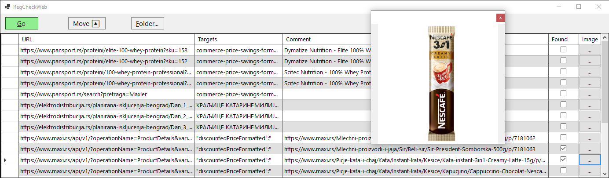

# RegCheckWeb

## TODO
- [ ] Add Groups/Categories as a parent to WebPages: DGV (name, webiste, enable)
- [ ] Close the app if nothing is found (maybe after some delay so that user have time to access its interface)
	- [ ] App should start in the background
